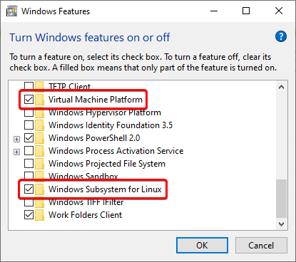

_Please note that this article was underwritten. The article will be ready in a few hours._

I've been using Windows 10 AME as my primary operating system for several months now, with a little break in the form of using vanilla Windows 10/11. Despite the fact that I do not use GNU/Linux desktop for several reasons, I still prefer to use at least one GNU/Linux distribution via WSL 2 to develop my projects and more.

In this guide I will show how you can install WSL 2 using two methods - automatic and manual.

## Prerequisites

- An AMD64 or ARM64 CPU with virtualization support.
- "Windows Subsystem for Linux" and "Virtual Machine Platform" features enabled on the system.
- WSL 2 kernel update.
- Windows Terminal.

### CPU Virtualization

To confirm that your CPU supports virtualization, just open Task Manager, open the "Performance" tab and look at the "Virtualization" value in the CPU section.


If virtualization is disabled, you should restart in the BIOS/UEFI and enable the corresponding option. If you don't have that option, this guide is not for you.

### Enabling features

Open "Run" (Win+R), type `OptionalFeatures` and press Enter. Scroll to the very bottom and from this list select "Virtual Machine Platform" and "Windows Subsystem for Linux". After that, I suggest you restart the system.



### Updating the kernel

Microsoft provides the WSL 2 kernel update in a separate package. It is available for both [AMD64](https://wslstorestorage.blob.core.windows.net/wslblob/wsl_update_x64.msi) and [ARM64](https://wslstorestorage.blob.core.windows.net/wslblob/wsl_update_arm64.msi). After installation, you should restart the system and enter this command in the elevated cmd/PowerShell window:

```bash
wsl --set-default-version 2
```

It sets WSL 2 as the default version for future installations of WSL distributions.

## Automatic installation

[Joe](https://git.ameliorated.info/Joe) from the AME community has written a ["Central AME Script" or "amecs"](https://git.ameliorated.info/Joe/amecs/src/branch/master) to help you easily accomplish certain tasks in Windows 10 AME. Among them is installing WSL distributions, which is what we need.

You need to download the file "amecs.zip", which can be found [here](https://git.ameliorated.info/Joe/amecs/releases/latest).


Right now we are on the main screen. What we need is in the "Extra" category. Press E.


Here it is! You can manage WSL distributions in "Extra" > "Manage WSL". Press 1 and then 2.


Here you can choose any WSL distribution supported by Microsoft itself. Select any one you like from the list by clicking on the appropriate button specified in the choices.


Now it is worth waiting. Once the download is complete, the script will do its job and prompt you to select a password for the `root` and create a new UNIX user.


After that, the distribution was completely installed!


## Manual installation

_TODO_
